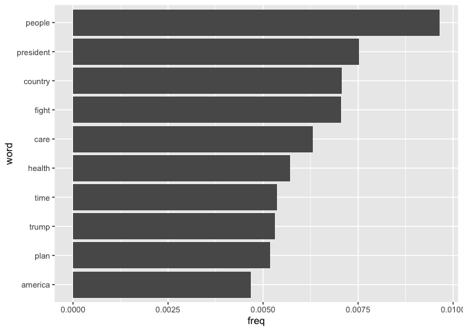
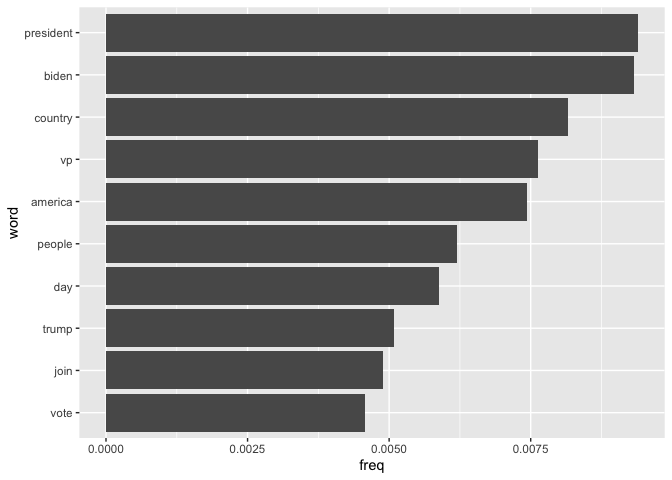
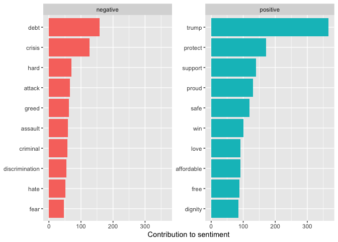
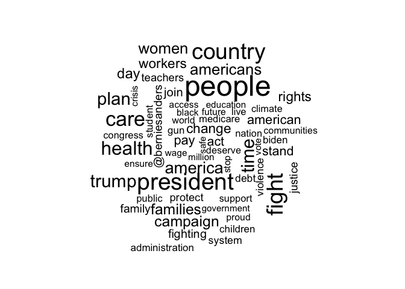
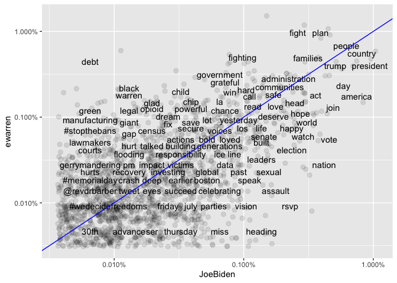
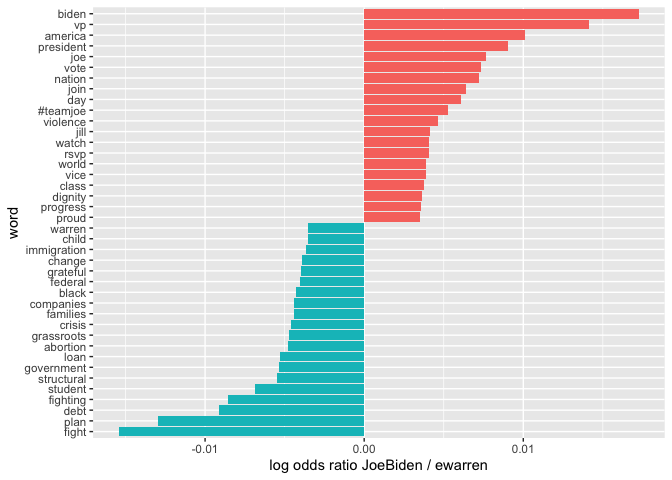

Text Analysis
================
Your name here
October 3, 2019

# In class exercise

### Load the data

``` r
tweets <- tweets %>%
  filter(!str_detect(text, "^RT")) %>%   #get rid of retweets
  mutate(timestamp = ymd_hms(created_at)) %>%
  select("timestamp","screen_name", "text")
tweets %>%
  slice(1:3)
```

    ##             timestamp screen_name
    ## 1 2019-07-24 15:29:45    JoeBiden
    ## 2 2019-07-24 12:41:28    JoeBiden
    ## 3 2019-07-23 23:23:10    JoeBiden
    ##                                                                                                                                                                                                                                                                                            text
    ## 1                                                                                                                                                                                  I'm about to take the stage at the @NAACP Presidential Candidates Forum. Watch live! https://t.co/7OrinSc8gy
    ## 2                                                                                      Watch as our very own @SymoneDSanders breaks down @JoeBiden’s newly released plan to reform the criminal justice system.\n\nTo view the full plan, visit https://t.co/bZM4oiiKcg https://t.co/9tumtINB2I
    ## 3 It’s about time we start rewarding workers with the resources to live with dignity &amp; respect—that begins with better wages and benefits, and the right to collectively organize and strike.\nToday, I stand with @unitehere airline catering workers as they rally together at DCA. #1Job

### Remove symbols and unnest into one-word tokens

``` r
remove_reg <- "&amp;|&lt;|&gt;"
tidy_tweets <- tweets %>%
  mutate(text = str_remove_all(text, remove_reg))%>%
  unnest_tokens(word, text, token = "tweets")
```

    ## Using `to_lower = TRUE` with `token = 'tweets'` may not preserve URLs.

``` r
tidy_tweets %>%
  slice(1:5)
```

    ##             timestamp screen_name  word
    ## 1 2019-07-24 15:29:45    JoeBiden    im
    ## 2 2019-07-24 15:29:45    JoeBiden about
    ## 3 2019-07-24 15:29:45    JoeBiden    to
    ## 4 2019-07-24 15:29:45    JoeBiden  take
    ## 5 2019-07-24 15:29:45    JoeBiden   the

``` r
counts <- tidy_tweets %>%
  count(word, sort = T)
counts %>%
  slice(1:10)
```

    ## # A tibble: 10 x 2
    ##    word      n
    ##    <chr> <int>
    ##  1 the    6091
    ##  2 to     5745
    ##  3 and    4119
    ##  4 a      3150
    ##  5 of     2785
    ##  6 in     2693
    ##  7 for    2338
    ##  8 we     2187
    ##  9 is     1860
    ## 10 our    1772

``` r
tidy_tweets <- tidy_tweets %>%
  filter(!word %in% stop_words $ word,
         !word %in% str_remove_all(stop_words$word, "'"),
         str_detect(word, "[a-z]"))
counts <- tidy_tweets %>%
  count(word, sort = T)
counts %>%
  slice(1:10)
```

    ## # A tibble: 10 x 2
    ##    word          n
    ##    <chr>     <int>
    ##  1 people      664
    ##  2 president   518
    ##  3 country     487
    ##  4 fight       486
    ##  5 care        434
    ##  6 health      393
    ##  7 time        370
    ##  8 trump       366
    ##  9 plan        357
    ## 10 america     322

``` r
frequency_all <-  tidy_tweets %>%
  count(word, sort = T) %>%
  mutate(freq = n / sum(n)) 

ggplot(frequency_all %>% top_n(10, freq) %>%
         mutate(word = reorder(word, freq)), aes(x = word, y = freq))+
  geom_col()+ 
  coord_flip() 
```

<!-- -->

``` r
## frequencies by candidate
frequency <- tidy_tweets %>%
  group_by(screen_name) %>%
  count(word, sort = T) %>%
  left_join(tidy_tweets %>%
              group_by(screen_name) %>%
              summarise(total = n()),
            by = "screen_name") %>%
  mutate(freq = n / total)


ggplot(frequency %>% 
         # choose candidate here
         filter(screen_name == "JoeBiden") %>% 
         top_n(10, freq) %>%
         mutate(word = reorder(word, freq)),
       aes(x = word, y = freq))+
  geom_col()+ 
  coord_flip() 
```

<!-- -->

### Sentiment analysis

``` r
tidy_tweets %>%
  # choose candidate here
  filter(screen_name == "ewarren") %>%
  inner_join(get_sentiments("bing"), by = "word") %>%
  count(sentiment) %>%
  spread(sentiment, n) %>%
  mutate(sentiment = positive - negative)
```

    ## # A tibble: 1 x 3
    ##   negative positive sentiment
    ##      <int>    <int>     <int>
    ## 1     1174     1161       -13

``` r
bing_counts <- tidy_tweets %>%
  inner_join(get_sentiments("bing"), by = "word") %>%
  count(word, sentiment, sort = T) 
bing_counts %>%
  group_by(sentiment) %>%
  top_n(10, n) %>%
  ungroup() %>%
  mutate(word = reorder(word, n)) %>%
  ggplot(aes(x= word, y = n, fill = sentiment))+
  geom_col(show.legend = F) +
  facet_wrap(~sentiment, scales = "free_y")+
  labs(y = "Contribution to sentiment", x = NULL) + 
  coord_flip()
```

<!-- -->

### Wordclouds

``` r
tidy_tweets %>%
  count(word) %>%
  with(wordcloud(word, n, max.words = 60,scale=c(3,.5)))
```

<!-- -->

### Comparing candidates: word frequency

``` r
frequency <- frequency %>%
  select(screen_name, word, freq) %>%
  spread(screen_name, freq) %>%
  arrange(BernieSanders, ewarren, JoeBiden, KamalaHarris)

ggplot(frequency, aes(JoeBiden, ewarren))+
  geom_jitter(alpha = 0.1, size = 2.5, width = 0.25, height = 0.25) +
  geom_text(aes(label = word), check_overlap = T, vjust = 1.5)+
  scale_x_log10(labels = percent_format())+
  scale_y_log10(labels = percent_format())+
  geom_abline(color = "blue")
```

    ## Warning: Removed 12087 rows containing missing values (geom_point).

    ## Warning: Removed 12087 rows containing missing values (geom_text).

<!-- -->

### Comparing candidates: word probabilities

``` r
# choose candidates
cands <- c("JoeBiden", "ewarren")

# create dataframe of log odds ratios
word_ratios <- tidy_tweets %>%
  filter(screen_name %in% cands) %>%
  filter(!str_detect(word, "^@")) %>%
  count(word, screen_name) %>%
  group_by(word) %>%
  filter(sum(n) >= 10) %>% # only consider more frequently uses words
  ungroup() %>%
  spread(screen_name, n, fill = 0) %>%
  mutate_if(is.numeric, list(~(. +1) / sum(.) + 1)) %>%
  mutate(logratio = log(eval(parse(text = cands[1]))/eval(parse(text = cands[2])))) %>%
  select(word, logratio)%>%
  arrange(desc(logratio))

word_ratios 
```

    ## # A tibble: 636 x 2
    ##    word      logratio
    ##    <chr>        <dbl>
    ##  1 biden      0.0173 
    ##  2 vp         0.0141 
    ##  3 america    0.0101 
    ##  4 president  0.00906
    ##  5 joe        0.00765
    ##  6 vote       0.00733
    ##  7 nation     0.00719
    ##  8 join       0.00638
    ##  9 day        0.00606
    ## 10 #teamjoe   0.00524
    ## # … with 626 more rows

``` r
word_ratios %>% 
  group_by(logratio < 0) %>%
  top_n(20, abs(logratio)) %>%
  ungroup() %>%
  mutate(word = reorder(word, logratio))%>%
  ggplot(aes(word, logratio, fill = logratio < 0)) +
  geom_col(show.legend = F) +
  coord_flip() +
  ylab(paste("log odds ratio", cands[1], "/", cands[2])) +
  scale_fill_discrete(name = "", labels = c(cands[1], cands[2]))
```

<!-- -->

### n-grams

``` r
tweet_bigrams <- tweets %>%
  select(screen_name, text) %>%
  mutate(text = str_remove_all(text, remove_reg))%>%
  unnest_tokens(bigram, text, token = "ngrams", n = 2)
```

``` r
my_stop_words <- tibble(word = c("http", "https"), lexicon = c("custom"))
custom_stop_words <- bind_rows(my_stop_words, stop_words)

bigrams_sep <- tweet_bigrams %>%
  separate(bigram, c("word1", "word2"), sep = " ") 
bigrams_filtered <- bigrams_sep %>%
  filter(!word1 %in% custom_stop_words$word,
         !word1 %in% str_remove_all(custom_stop_words$word, "'"),
         str_detect(word1, "[a-z]"), 
         !word2 %in% custom_stop_words$word,
         !word2 %in% str_remove_all(custom_stop_words$word, "'"),
         str_detect(word2, "[a-z]"))
```

``` r
bigram_counts <- bigrams_filtered %>%
  count(word1, word2, sort = T)
bigram_counts 
```

    ## # A tibble: 21,717 x 3
    ##    word1    word2        n
    ##    <chr>    <chr>    <int>
    ##  1 health   care       276
    ##  2 middle   class      111
    ##  3 it’s     time       100
    ##  4 climate  change      99
    ##  5 donald   trump       98
    ##  6 gun      violence    90
    ##  7 vp       biden       81
    ##  8 wall     street      70
    ##  9 white    house       68
    ## 10 american people      65
    ## # … with 21,707 more rows

# On your own

``` r
sou <- sou %>%
  mutate(Text = as.character(Text))
```

1.  Finish the code below to create a tidytext dataframe called
    `sou_tidy`.

<!-- end list -->

``` r
sou_tidy <- sou %>%
  unnest_tokens(output = word, input = Text)

# sou_tidy <- sou %>%
#   unnest_tokens(output = word, input = ?)
```

Before we start calculating word counts or frequencies, let’s go ahead
and remove the annoying stop words. With the Twitter data, we had to do
a little extra work to remove the stop words due to the format of
tweets. With regular text, we can use the simple `anti_join()` function
to remove the stop words from the tidytext:

``` r
sou_tidy <- sou_tidy %>%
  anti_join(stop_words, by = "word")
```

2.  What are the five words that are used most frequently across the two
    presidents?

<!-- end list -->

``` r
# sou_tidy %>%
#   count(word, sort = T)
```

3.  Interestingly, the word “applause” is used a lot in the State of the
    Union addresses. That is quite odd, but there is a reason for it\!
    Run the following code and explain why that is:

<!-- end list -->

``` r
sou %>%
  filter(str_detect(Text,"Applause")) %>%
  select(Text) %>%
  slice(1:5)
```

    ##                                                                                                                                                                                                                                                                                                                                                                                                                                                                                                                                      Text
    ## 1                                                                                                                                                             Our economy is stronger when we harness the talents and ingenuity of striving, hopeful immigrants. And right now leaders from the business, labor, law enforcement, faith communities, they all agree that the time has come to pass comprehensive immigration reform. Now is the time to do it. Now is the time to get it done. [Applause] Now is the time to get it done.
    ## 2                                                                                                                                              In other words, we know what needs to be done. And as we speak, bipartisan groups in both Chambers are working diligently to draft a bill, and I applaud their efforts. So let's get this done. Send me a comprehensive immigration reform bill in the next few months, and I will sign it right away. And America will be better for it. Let's get it done. [Applause] Let's get it done.
    ## 3         Hadiya's parents, Nate and Cleo, are in this Chamber tonight, along with more than two dozen Americans whose lives have been torn apart by gun violence. They deserve a vote. They deserve a vote. [Applause] They deserve a vote. Gabby Giffords deserves a vote. The families of Newtown deserve a vote. The families of Aurora deserve a vote. The families of Oak Creek and Tucson and Blacksburg, and the countless other communities ripped open by gun violence, they deserve a simple vote. They deserve a simple vote.
    ## 4 We should follow the example of a North Miami woman named Desiline Victor. When Desiline arrived at her polling place, she was told the wait to vote might be 6 hours. And as time ticked by, her concern was not with her tired body or aching feet, but whether folks like her would get to have their say. And hour after hour, a throng of people stayed in line to support her, because Desiline is 102 years old. And they erupted in cheers when she finally put on a sticker that read, "I voted." [Applause] There's Desiline.
    ## 5                              As usual, our First Lady sets a good example. [Applause] Well—[applause]. Michelle's "Let's Move!" partnership with schools, businesses, local leaders has helped bring down childhood obesity rates for the first time in 30 years. And that's an achievement that will improve lives and reduce health care costs for decades to come. The Joining Forces alliance that Michelle and Jill Biden launched has already encouraged employers to hire or train nearly 400,000 veterans and military spouses.

4.  So we should remove the word “applause” from our tidytext. For
    similar reasons, we should remove the word “laughter”. Create a
    custom list of stop words, and use it to create a new `sou_tidy`
    tidytext. Finally, display the ten most used words across the two
    presidents.

<!-- end list -->

``` r
my_stop_words <- tibble(word = c("applause", "laughter"), lexicon = "custom")
custom_stop_words <- bind_rows(my_stop_words, stop_words)
sou_tidy <- sou_tidy %>%
  anti_join(custom_stop_words, by = "word")
sou_tidy %>%
  count(word, sort = T) %>%
  slice(1:10)
```

    ## # A tibble: 10 x 2
    ##    word          n
    ##    <chr>     <int>
    ##  1 america     187
    ##  2 american    180
    ##  3 people      148
    ##  4 americans   129
    ##  5 country     114
    ##  6 jobs        108
    ##  7 tonight     106
    ##  8 time        104
    ##  9 world       102
    ## 10 congress     90

``` r
# my_stop_words <- tibble(word = c(?, ?), lexicon = "custom")
# custom_stop_words <- bind_rows(my_stop_words, stop_words)
# sou_tidy <- ?
```

The following code calculates the word frequencies of Obama vs the word
frequencies of Trump in their State of the Union addresses.

``` r
pres_frequency <- sou_tidy %>%
  group_by(President) %>%
  count(word, sort = T) %>%
  left_join(sou_tidy %>%
              group_by(President) %>%
              summarise(total = n()),
            by = "President") %>%
  mutate(freq = n / total)
pres_frequency %>%
  slice(1:5)
```

    ## # A tibble: 10 x 5
    ## # Groups:   President [2]
    ##    President word          n total    freq
    ##    <fct>     <chr>     <int> <int>   <dbl>
    ##  1 Obama     america     120 10205 0.0118 
    ##  2 Obama     people       91 10205 0.00892
    ##  3 Obama     jobs         83 10205 0.00813
    ##  4 Obama     american     81 10205 0.00794
    ##  5 Obama     americans    72 10205 0.00706
    ##  6 Trump     american     99  6734 0.0147 
    ##  7 Trump     america      67  6734 0.00995
    ##  8 Trump     americans    57  6734 0.00846
    ##  9 Trump     people       57  6734 0.00846
    ## 10 Trump     country      56  6734 0.00832

5.  Using `pres_frequency`, create a plot of the top 20 most frequently
    used terms of Obama, and another plot of the top 20 most frequently
    used terms of Trump. Comment on the similarities/differences.

<!-- end list -->

``` r
# ggplot(pres_frequency %>% 
#          filter(President == "Obama") %>% 
#          top_n(20, freq) %>%
#          mutate(word = reorder(word, freq)),
#        aes(x = word, y = freq))+
#   geom_col()+ 
#   coord_flip() 
# 
# ggplot(pres_frequency %>% 
#          filter(President == "Trump") %>% 
#          top_n(20, freq) %>%
#          mutate(word = reorder(word, freq)),
#        aes(x = word, y = freq))+
#   geom_col()+ 
#   coord_flip() 
```

6.  Using the `bing` lexicon, analyze the sentiment of the State of the
    Unions across the two presidents. Looking at all the addresses, what
    is the most commonly used negative word, and what is the most
    commonly used positive word?

<!-- end list -->

``` r
sou_tidy %>%
  inner_join(get_sentiments("bing"), by = "word") %>%
  count(word, sentiment, sort = T) %>%
  group_by(sentiment) %>%
  summarize(max = max(n))
```

    ## # A tibble: 2 x 2
    ##   sentiment   max
    ##   <chr>     <int>
    ## 1 negative     53
    ## 2 positive     41

7.  Calculate the overall sentiment of Obama’s addresses, and also
    calculate the overall sentiment of Trump’s addresses. Which
    president is more positive/negative in sentiment? (Hint: use code
    similar to the Twitter data, but consider using the `group_by()`
    function instead of `filter()`.)

<!-- end list -->

``` r
# sou_tidy %>%
#   group_by(President) %>%
#   inner_join(get_sentiments("bing"), by = "word") %>%
#   count(sentiment) %>%
#   spread(sentiment, n) %>%
#   mutate(sentiment = positive - negative)
```

8.  Make a word cloud for the top 50 words used in all the State of the
    Union addresses. (Note, the first time you knit this, it may take
    awhile.)

<!-- end list -->

``` r
# sou_tidy %>%
#   count(word) %>%
#   with(wordcloud(word, n, max.words = 75,scale=c(3,.5)))
```

9.  Lastly, we would appreciate any feedback you may have for us\!
    Positive or negative, we welcome it all\!
